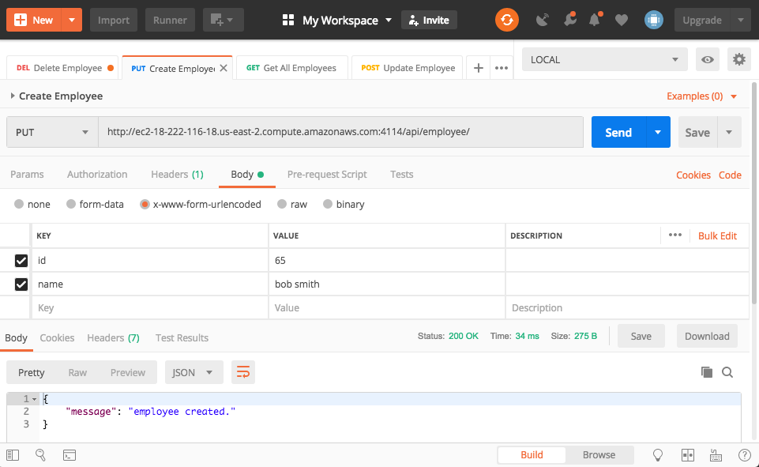

[Neo-App](#neo-app)
- [Neo-App](#neo-app)
  - [Intro](#intro)
  - [Sample Application Screenshots](#sample-application-screenshots)
  - [GIT Repository](#git-repository)
  - [UI Setup](#ui-setup)
  - [Express Server](#express-server)
  - [Neo-App REST API](#neo-app-rest-api)
    - [Basic CURL commands to exercise the API](#basic-curl-commands-to-exercise-the-api)
  - [Source Code - Employee Files](#source-code---employee-files)

# Neo-App

## Intro
Simple web application which can be used to drive the API.  THe application was built using Angular CLI (7.1.2), and leverages a few Angular web frameworks, for asthetics, including ngx-admin, and nebular.  The GIT project consists of a base ngx-admin application, with additions for an Employee table.  The app was built in "production-mode", and deployed to a web server (Tomcat) on the EC2 instance.  A dashboard web component exists which contains a single table with actions that communicate with the backend services from the Angular Employee service to the Express REST server via port 4114.

Application URL: http://ec2-18-222-116-18.us-east-2.compute.amazonaws.com:8080/

Neo4j Browser: http://ec2-18-222-116-18.us-east-2.compute.amazonaws.com:7474/browser/

## Sample Application Screenshots


## GIT Repository

- 

## UI Setup
If you would like to setup the Express server locally, follow these steps:
1. Have the latest stable versions of node/npm and git installed in your dev environment
2. clone the git repo for this project
3. ```node install```
4. ```ng start```

## Express Server
If you would like to setup the Express server locally, follow these steps:
1. Have the latest stable versions of node/npm and git installed in your dev environment
2. clone the git repo for this project
3. ```node install```
4. ```cd server```
5. ```node index.js```
THe server will startup on port 4114.  You can test that it is running by following this URL: http://localhost:4114/api/employee

## Neo-App REST API
The Middle Tier server is implemented using NodeJS/Express, and the Neo4J Bolt Driver to access the database. REST implementations for the EMployee resources were created for GET, POST, PUT, and DELETE.

If you are familiar with PostMan, I have published the API documentation, which can be accessed on their public repository at: https://documenter.getpostman.com/view/6011757/RzfiJUYp
(see screenshots of PostMan at the bottom of this doc)

### Basic CURL commands to exercise the API

- GET All Employees:
```  
curl --location --request GET "http://ec2-18-222-116-18.us-east-2.compute.amazonaws.com:4114/api/employee/"
```
- Create Employee:
  
```
curl --location --request PUT "http://ec2-18-222-116-18.us-east-2.compute.amazonaws.com:4114/api/employee/" \
--header "Content-Type: application/x-www-form-urlencoded" \
--data "id=65&name=bob%20smith"
```

- Remove Employee:
```
curl --location --request DELETE "http://ec2-18-222-116-18.us-east-2.compute.amazonaws.com:4114/api/employee/65" \
  --data ""
```

- Update Employee:
```
curl --location --request POST "http://ec2-18-222-116-18.us-east-2.compute.amazonaws.com:4114/api/employee/65" \
  --header "Content-Type: application/x-www-form-urlencoded" \
  --data "id=55&name=Robert%20Jones"
```  





Neo4j Browser: http://ec2-18-222-116-18.us-east-2.compute.amazonaws.com:7474/browser/


## Source Code - Employee Files

- neo-app/server/index.js ( Express REST API)
- neo-app/src/app/pages/dashboard/dashboard.component.ts
- neo-app/src/app/pages/dashboard/dashboard.component.html
- neo-app/src/app/@core/data/employee.service.ts